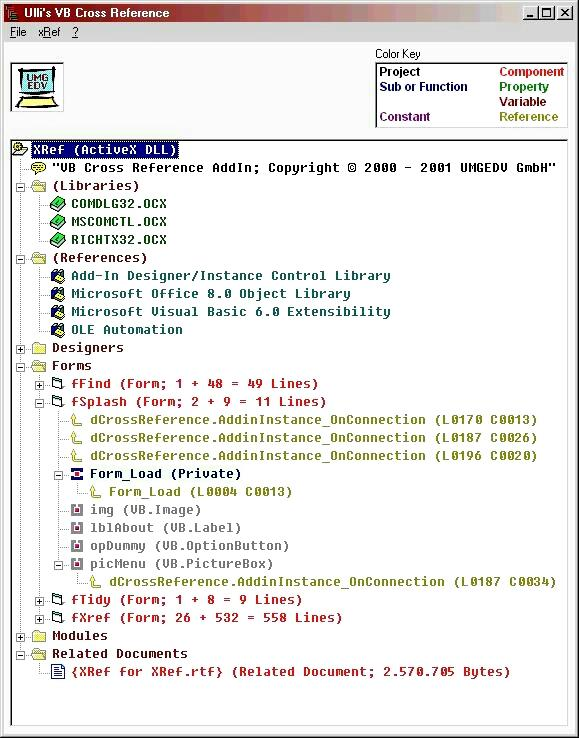



## Ulli's VB Cross Reference AddIn

### Description

This Add-In creates a Cross Reference Listing for your VB Projects. The X-Ref shows all Public, Global, Friend and Private Data- and Code-Member definitions, where they are defined, their scope (Private / Public / Friend), and what they are: Sub or Function, Property, Event, Variable or Constant. Also shown are all references to these members with ComponentName.MemberName as well as Line and Column numbers. References to Components are also shown.

The Cross Reference Listing may be exported to a color-coded RTF file (see screen shot) or to the Clipboard for subsequent pasting into the project or anywhere else.

This is the second in the my suite of VB-Add-Ins and goes together with the Code Formatter. It will help you to professionally document your projects in a tidy and consistent way.

Compile the DLL into your VB directory and then use the Add-Ins Manager to load the Cross Reference Add-In into VB.

Fixed bugs with Resorce Files and Related Documents and added Icons as well as references to Controls, Libraries, and References.
 
### More Info
 

             |
---                |---
**Submitted On**   |2001-11-24 15:24:48
**By**             |[ULLI](https://github.com/Planet-Source-Code/PSCIndex/blob/master/ByAuthor/ulli.md)
**Level**          |Advanced
**User Rating**    |4.6 (41 globes from 9 users)
**Compatibility**  |VB 6\.0
**Category**       |[VB function enhancement](https://github.com/Planet-Source-Code/PSCIndex/blob/master/ByCategory/vb-function-enhancement__1-25.md)
**World**          |[Visual Basic](https://github.com/Planet-Source-Code/PSCIndex/blob/master/ByWorld/visual-basic.md)
**Archive File**   |[Ulli's\_VB\_3713311242001\.zip](https://github.com/Planet-Source-Code/ulli-ulli-s-vb-cross-reference-addin__1-29173/archive/master.zip)

